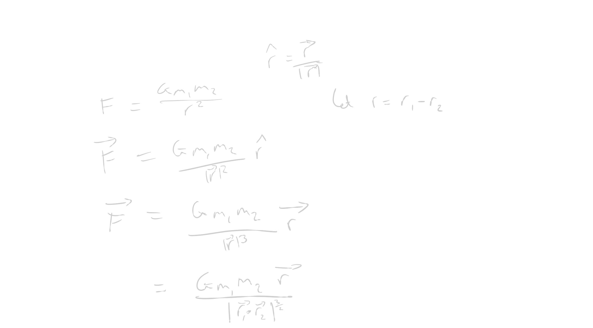

# Space Pathfinder

Goal: 3D space flight sim with manual or automated controls

# Features

- [x] Create game loop
- [ ] Consider softening on r_sqaured
- [ ] Look at velocity verlet
- [ ] Create a crude 2D renderer for testing purposes
- [ ] Break down simulation, renderer, camera and automated control into different modules

